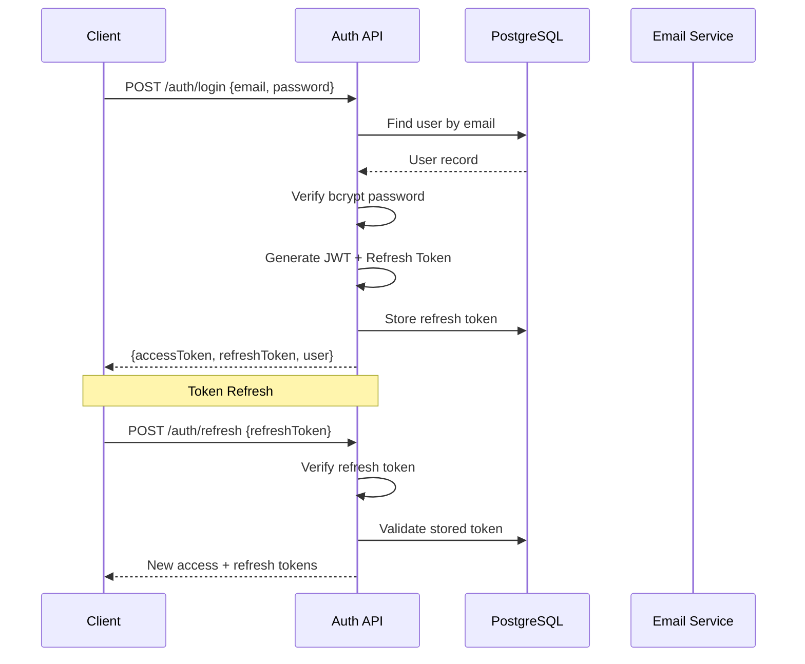
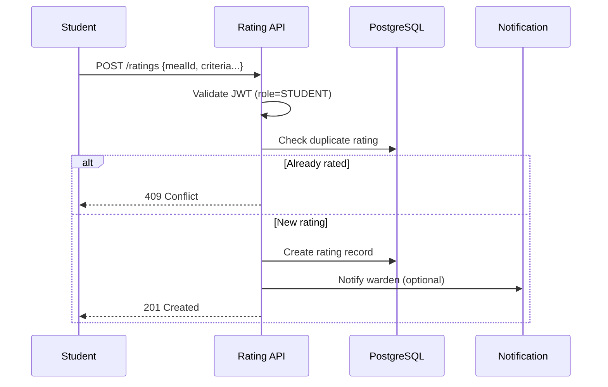
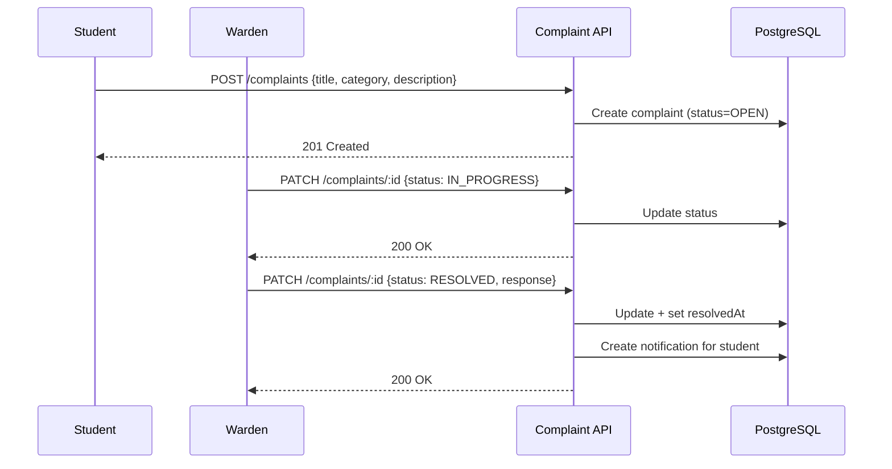
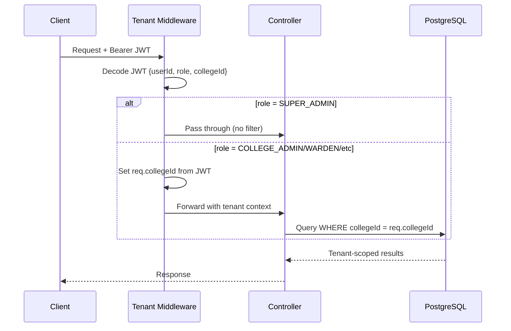
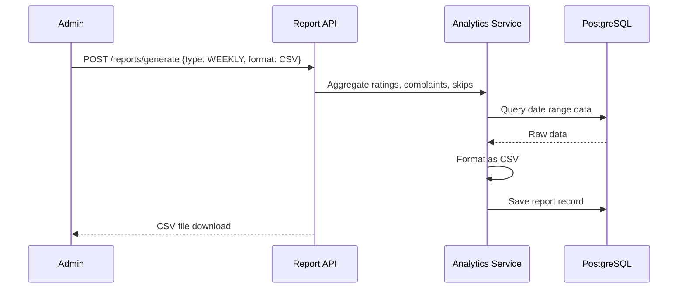

# CDIP Sequence Diagrams

## Authentication Flow

```mermaid
sequenceDiagram
    participant C as Client
    participant A as Auth API
    participant DB as PostgreSQL
    participant E as Email Service

    C->>A: POST /auth/login {email, password}
    A->>DB: Find user by email
    DB-->>A: User record
    A->>A: Verify bcrypt password
    A->>A: Generate JWT + Refresh Token
    A->>DB: Store refresh token
    A-->>C: {accessToken, refreshToken, user}

    Note over C,A: Token Refresh
    C->>A: POST /auth/refresh {refreshToken}
    A->>A: Verify refresh token
    A->>DB: Validate stored token
    A-->>C: New access + refresh tokens
```

## Meal Rating Flow

```mermaid
sequenceDiagram
    participant S as Student
    participant API as Rating API
    participant DB as PostgreSQL
    participant N as Notification

    S->>API: POST /ratings {mealId, criteria...}
    API->>API: Validate JWT (role=STUDENT)
    API->>DB: Check duplicate rating
    alt Already rated
        API-->>S: 409 Conflict
    else New rating
        API->>DB: Create rating record
        API->>N: Notify warden (optional)
        API-->>S: 201 Created
    end
```

## Complaint Resolution Flow

```mermaid
sequenceDiagram
    participant S as Student
    participant W as Warden
    participant API as Complaint API
    participant DB as PostgreSQL

    S->>API: POST /complaints {title, category, description}
    API->>DB: Create complaint (status=OPEN)
    API-->>S: 201 Created

    W->>API: PATCH /complaints/:id {status: IN_PROGRESS}
    API->>DB: Update status
    API-->>W: 200 OK

    W->>API: PATCH /complaints/:id {status: RESOLVED, response}
    API->>DB: Update + set resolvedAt
    API->>DB: Create notification for student
    API-->>W: 200 OK
```

## Multi-Tenant Request Flow

```mermaid
sequenceDiagram
    participant C as Client
    participant M as Tenant Middleware
    participant API as Controller
    participant DB as PostgreSQL

    C->>M: Request + Bearer JWT
    M->>M: Decode JWT {userId, role, collegeId}
    
    alt role = SUPER_ADMIN
        M->>API: Pass through (no filter)
    else role = COLLEGE_ADMIN/WARDEN/etc
        M->>M: Set req.collegeId from JWT
        M->>API: Forward with tenant context
        API->>DB: Query WHERE collegeId = req.collegeId
    end
    
    DB-->>API: Tenant-scoped results
    API-->>C: Response
```

## Report Generation Flow

```mermaid
sequenceDiagram
    participant A as Admin
    participant API as Report API
    participant AS as Analytics Service
    participant DB as PostgreSQL

    A->>API: POST /reports/generate {type: WEEKLY, format: CSV}
    API->>AS: Aggregate ratings, complaints, skips
    AS->>DB: Query date range data
    DB-->>AS: Raw data
    AS->>AS: Format as CSV
    AS->>DB: Save report record
    API-->>A: CSV file download
```
